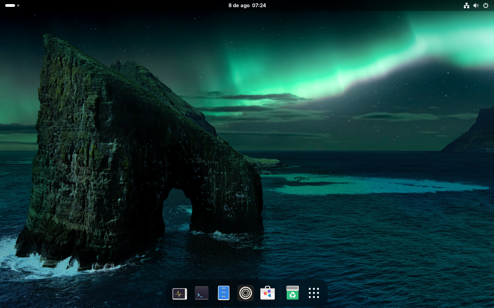
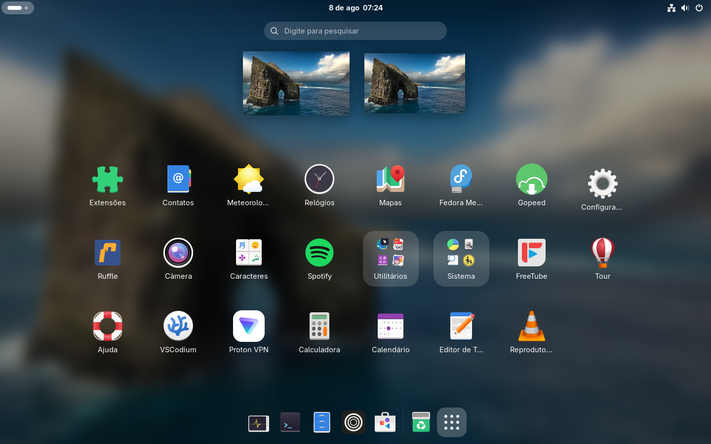

# Silverblue Enhanced

*A shell script for Fedora Silverblue to reflect my tastes.*

## Table of Contents
- [Introduction](#introduction)
- [Screenshots](#screenshots)
- [Usage](#Usage)
    - [Setup](#shortcuts)
    - [Shortcuts](#shortcuts)

## Introduction

This is a shell script; it does not pretend to be more than that. It is backed by upstream Fedora Atomic and, even it if it dies, shall stay undead. I've written it to improve GNOME to my preferences, these are:

- **Blur My Shell, Dash to Dock, other extensions**
- **elementary OS default wallpapers**
- **Zen as the default web browser**
- **VSCodium and VLC (with codecs) from Flathub**
- **Zero overlays**
- **Bash Vi Mode**
- **Other careful tweaks**

## Screenshots





## Usage

### Setup

1. Finish GNOME's setup wizard and run:
```bash
systemd-inhibit --what=sleep --why="Running desktop setup" bash ./setup.sh'' 
```
2. Enter your password and wait for reboot.

### Shortcuts

- **Super+f**: nautilus
- **Super+t**: new terminal window
- **Super+b**: zen browser
